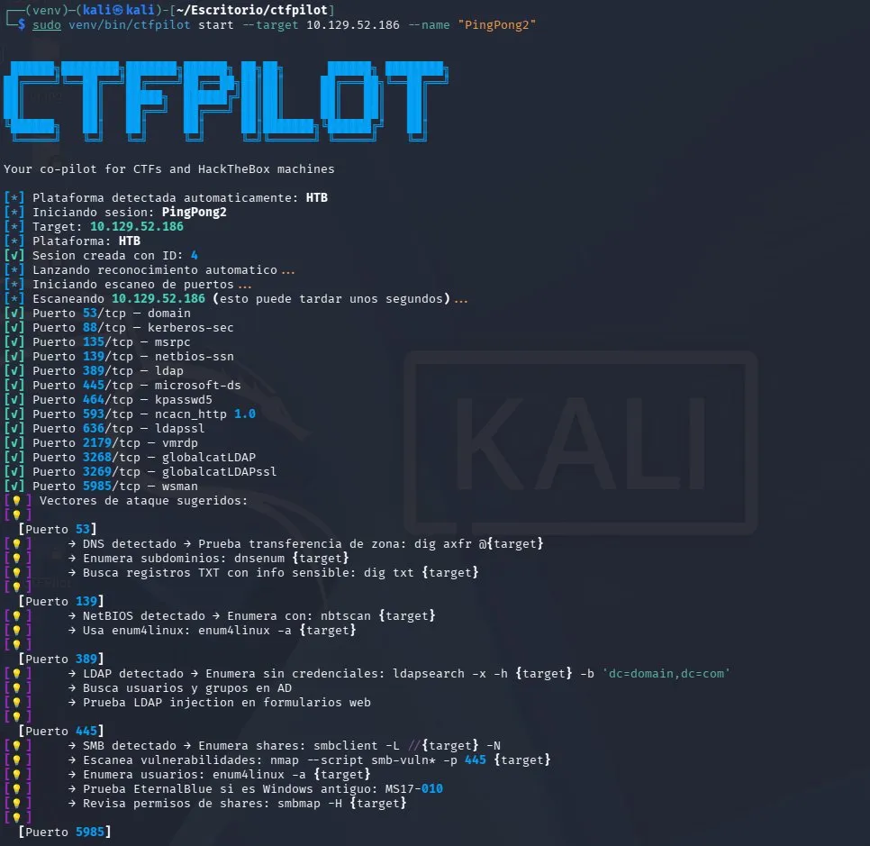
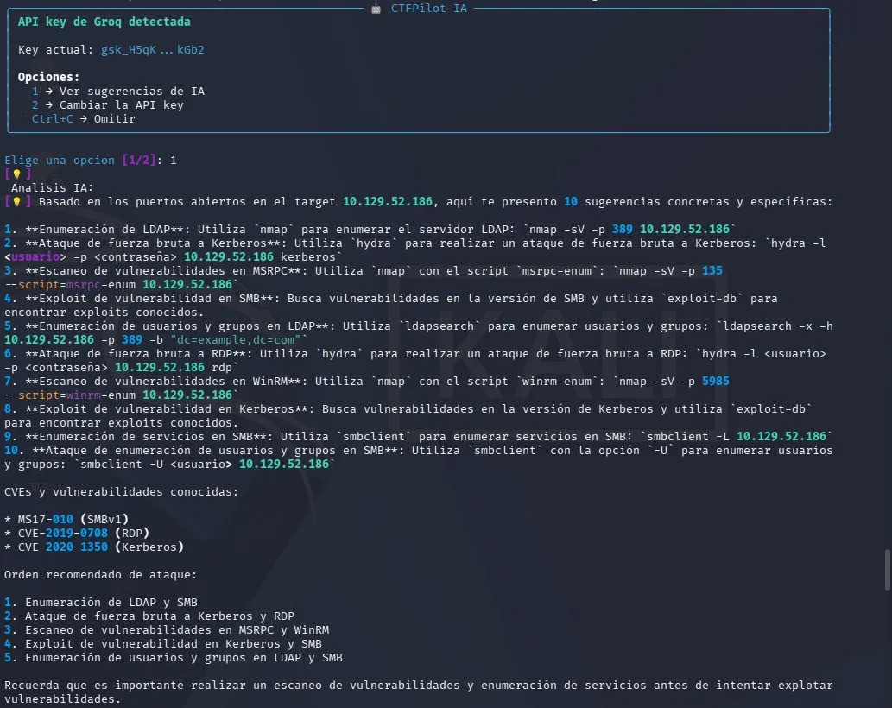
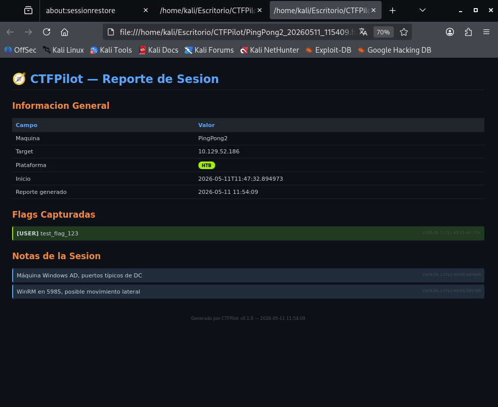

# 🧭 CTFPilot

> Tu copiloto para CTFs y máquinas de HackTheBox




CTFPilot es una herramienta CLI profesional diseñada para asistir a pentesters durante competiciones CTF y máquinas de HackTheBox. Automatiza las partes tediosas — reconocimiento, búsqueda de CVEs, sugerencias de ataque, documentación — para que puedas centrarte en lo que importa: pensar y explotar.

---

## 📸 Capturas de pantalla





---

## ✨ Funcionalidades

- **Detección automática** de plataforma (HTB, THM, CTF) por rango de IP
- **Escaneo de puertos automatizado** con integración de Nmap
- **Búsqueda de CVEs** via API de NVD según versiones detectadas
- **Sugerencias inteligentes de vectores de ataque** por puerto y combinaciones
- **Análisis con IA** via API de Groq (llama-3.3-70b-versatile)
- **Gestión de sesiones** con SQLite (start, note, flag, finish)
- **Historial de sesiones** y timer de sesión activa
- **Recomendaciones de wordlists** por tipo de servicio
- **Reportes en múltiples formatos**: HTML, PDF y Markdown
- **Output de terminal limpio y profesional** con Rich

---

## 🛠️ Stack Tecnológico

| Componente | Tecnología | Propósito |
|---|---|---|
| Lenguaje | Python 3.11+ | Desarrollo principal |
| CLI | Typer + Rich | Interfaz de terminal |
| Base de datos | SQLite | Persistencia de sesiones |
| Escaneo de puertos | python-nmap | Wrapper de Nmap |
| Búsqueda CVEs | NVD API | Base de datos de vulnerabilidades |
| Sugerencias IA | Groq API | Análisis inteligente |
| Reportes | Jinja2 + WeasyPrint | Generación HTML/PDF |
| Contenedor | Docker | Portabilidad |
| CI/CD | GitHub Actions | Pipeline de automatización |
| SAST | Bandit | Análisis estático de código |
| Escaneo dependencias | Safety | Detección de vulnerabilidades |
| Escaneo imagen | Trivy | Seguridad del contenedor |
| Orquestación | Kubernetes | Manifiestos de despliegue |
| Monitoreo | Prometheus + Grafana | Métricas y dashboards |

---

## 📦 Instalación

### Desde el código fuente

```bash
git clone https://github.com/franjmenezz/ctfpilot.git
cd ctfpilot
python3 -m venv venv
source venv/bin/activate
pip install -r requirements.txt
pip install hatchling
python -m hatchling build -t wheel
pip install dist/*.whl
```

### Con Docker

```bash
docker pull franjmenezz/ctfpilot:latest
docker run --rm --network host franjmenezz/ctfpilot:latest start --target 10.10.11.25 --name "NombreMaquina"
```

> **Requisitos:** Nmap debe estar instalado en el sistema. En Kali Linux viene preinstalado.

---

## 🚀 Uso

### Iniciar una nueva sesión

```bash
# Detecta la plataforma automáticamente por IP (HTB, THM, CTF)
ctfpilot start --target 10.10.11.25 --name "NombreMaquina"

# O especifica la plataforma manualmente
ctfpilot start --target 10.10.11.25 --name "NombreMaquina" --platform htb
```

### Durante la sesión

```bash
# Añadir notas
ctfpilot note "Directorio /admin expuesto sin autenticación"
ctfpilot note "SSH en puerto 22, probando credenciales por defecto"

# Registrar flags capturadas
ctfpilot flag --type user --value "a3f5c8d1b2e4..."
ctfpilot flag --type root --value "9f2e1a4b7c8d..."

# Ver estado de la sesión
ctfpilot status

# Ver tiempo transcurrido
ctfpilot timer

# Relanzar reconocimiento manualmente
ctfpilot recon
ctfpilot recon --target 10.10.11.25
```

### Sugerencias de wordlists

```bash
ctfpilot wordlist http
ctfpilot wordlist smb
ctfpilot wordlist ssh
ctfpilot wordlist ftp
ctfpilot wordlist dns
ctfpilot wordlist user
ctfpilot wordlist pass
```

### Generar reportes

```bash
# Reporte HTML (guardado en ~/Escritorio/CTFPilot/)
ctfpilot report --format html

# Reporte PDF
ctfpilot report --format pdf

# Plantilla de writeup en Markdown
ctfpilot report --format md
```

### Gestión de sesiones

```bash
# Ver todas las sesiones anteriores
ctfpilot history

# Cerrar sesión activa
ctfpilot finish
```

### Configuración de IA

```bash
# Configurar API key de Groq (gratuita en console.groq.com)
ctfpilot ai-setup
```

---

## 📋 Referencia de Comandos

| Comando | Opciones | Descripción |
|---|---|---|
| `start` | `--target`, `--name`, `--platform` | Inicia una nueva sesión de pentesting |
| `note` | `[contenido]` | Añade una nota a la sesión activa |
| `flag` | `--value`, `--type` | Registra una flag capturada |
| `status` | — | Muestra detalles de la sesión activa |
| `timer` | — | Muestra el tiempo transcurrido |
| `recon` | `--target` (opcional) | Relanza el reconocimiento |
| `finish` | — | Cierra la sesión activa |
| `history` | — | Muestra el historial de sesiones |
| `wordlist` | `[servicio]` | Sugerencias de wordlists por servicio |
| `report` | `--format` | Genera reporte HTML, PDF o Markdown |
| `ai-setup` | — | Configura la API key de Groq para IA |

---

## 🔒 Pipeline DevSecOps

Cada push a main activa el pipeline CI/CD completo:

```
Push a main
    ↓
Tests y Calidad de Código (pytest)
    ↓
SAST - Análisis Estático (Bandit)
    ↓
Comprobación de Vulnerabilidades en Dependencias (Safety)
    ↓
Build Docker y Escaneo de Seguridad (Trivy)
    ↓
Validación de Manifiestos Kubernetes (kubeconform)
```

---

## 🐳 Docker

```bash
# Construir la imagen
docker build -t ctfpilot:latest .

# Ejecutar un comando
docker run --rm ctfpilot:latest --help
```

---

## ☸️ Kubernetes

Manifiestos disponibles en `k8s/`:

```bash
kubectl apply -f k8s/configmap.yml
kubectl apply -f k8s/pvc.yml
kubectl apply -f k8s/deployment.yml
kubectl apply -f k8s/network-policy.yml
```

---

## 📊 Monitoreo

```bash
cd monitoring
docker compose -f docker-compose.monitoring.yml up -d
```

- Prometheus: http://localhost:9090
- Grafana: http://localhost:3000 (admin/ctfpilot)

---

## 👤 Autor

**Francisco Jiménez** — Pentester y Desarrollador Full Stack orientado a DevSecOps

[](https://github.com/franjmenezz)

---

## 📄 Licencia

Licencia MIT — siéntete libre de usar y contribuir.

---

*[English version](README.md)*
